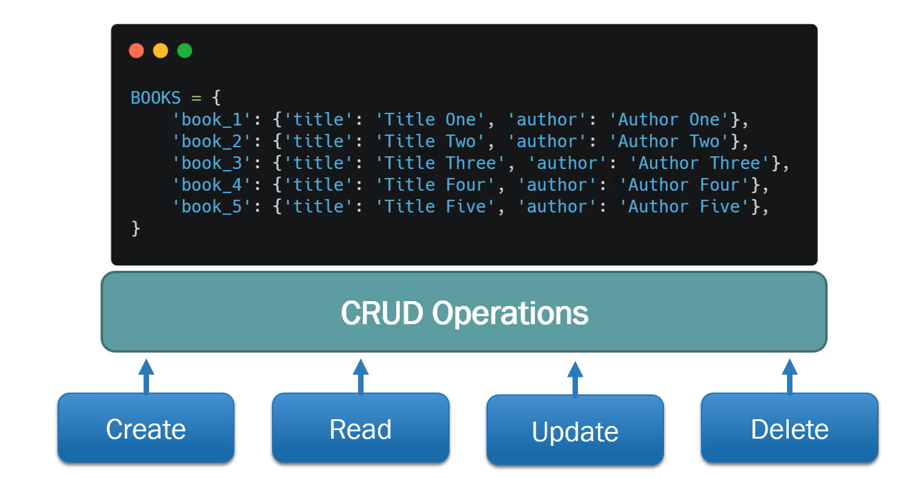
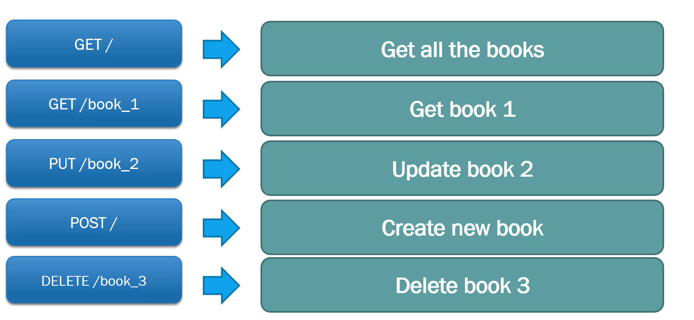

# FAST API Tutorial

## Running our first app

1. Create a new file called *books.py**
2. Then write the following code:
    ```python
    # importing FAST API
    from fastapi import FastAPI
    
    app = FastAPI()
    
    
    # create an asynchronous function
    @app.get("/")  # adding a descriptor
    async def first_api():
        return {"message": "Hello eric"}
    ```
    Here, first we say app=FastAPI()
    Then we create an asynchronous function which will return a dictionary, having the message as: Hello world.
    
    The ```@app.get('/')``` is the descriptor that is used in order to give the path.

3. Then, we need to run the server by:
   ```
   uvicorn books:app --reload
   ```
This will our first API that gives in return a dict object containing a message.

## Swagger, HTTP Request Methods and Status Codes Overview

### OAS

The Open API Specification, also called OAS, is a documentation on creating universal standard on how to create and handle APIs.
The OAS document defines:
1. The schema - Abstract definition of how an API should look like.
2. Data format - The format (JSON/YAML) in which the data should be handled.
3. Data types - The primitive data types which are handled throughout the requests and responses.
4. Path - Which is how to handle param if the specific API takes any.
5. Object - Tells how objects should be handled within the API.
6. Much more...

FastAPI generates the OpenAPI schema so that we can view the same at:  *http://127.0.0.1:8000/openapi.json*.

### Swagger - UI

When we create APIs, an interactive documentation is created using Swagger-UI. 
This can be used at: *http://127.0.0.1:8000/docs*

### HTTP Request Methods

REST APIs uses same requests methods as HTTP. It tells the server, what the request wants to do, that is coming in.
REST APIs typically include:
1. GET - Read method that retrieves data
2. POST - Create method to submit data
3. PUT - Update part of a resource
4. PATCH - Update entire resource
5. DELETE - Delete the resource

These operations are also known as the CRUD - Create, Read, Update, Delete
There are also some uncommon ones like:
1. TRACE - Performs a message loopback to the target
2. CONNECT - Creates a tunnel to the server based on the target
3. OPTIONS - Describes communication options to the target

### Status Codes

Some status codes are:
1. 1xx - Informational Response: Request Processing
2. 2xx - Success: Request Successfully Completed
3. 3xx - Redirection: Requires client to complete further action
4. 4xx - Client Error: Usually error caused by request from client
5. 5xx - Server Error: Error occurred on the server

### Async

In this course we use *async* in front of all our  functions:

Example: ```async def this_is_a_function():```

We use async in FastAPI, due to asynchronous code, concurrency, and parallelism.
Using async is not necessary when coding with FastAPI, we use ```def this_is_a_function():``` instead.
In any of the cases above, FastAPI will still work asynchronously and perform very fast.
Using async before the function, typically provides performance optimizations when handling asynchronous functions.


## Fast API Project 1 - Request Method Logic

### Overview

What we are trying to create:


REST API uses HTTP Requests methods to accomplish CRUD operations.



### Enhance GET request

We will be using our old **books.py** file. The first thing we will do is create a list of books.
```python
BOOKS = {
    'book_1': {'title': 'Title One', 'author': 'Author One'},
    'book_2': {'title': 'Title Two', 'author': 'Author Two'},
    'book_3': {'title': 'Title Three', 'author': 'Author Three'},
    'book_4': {'title': 'Title Four', 'author': 'Author Four'},
    'book_5': {'title': 'Title Five', 'author': 'Author Five'},

}
```
Then we will enhance our get API to return all the books.
```python
@app.get("/")  # adding a descriptor
async def read_all_books():
    return BOOKS
```
Then we can run the server by going to the same dir as the **books.py** and typing ```uvicorn books:app --reload```

### Path Parameters
Path parameter is a way in which we can add parameters to an API call. It typically happens when we are using a GET call or when we are using POST or anything where are needed to attach some kind of additional information to the URL that's not encrypted or secret from the client or the user.
We can try this by adding the following snippet in **books.py** file:
```python
@app.get("/books/{book_title}")
async def read_book(book_title):
    return {'book_title': book_title}
```
We can also specify the data type to be passed in the function:
```python
@app.get("/books/{book_id}")
async def read_book(book_id: int):
    return {'book_title': book_id}
```
Now, if we try to pass a string in the URL path, then we will get an error.
The order in which we write our functions matter. API calls that use path param, must be underneath any other kind of API that might be using a similar path.
```python
@app.get("/books/mybook")
async def my_favorite_book():
    return {'book_title': "My fav book"}


@app.get("/books/{book_id}")
async def read_book(book_id: int):
    return {'book_title': book_id}
```
Here, *read_book()* needs to be underneath *my_favorite_book()*


### Enumeration Path Parameters

This will let the client access limited paths, as mentioned in the particular list or whatever we are enumerating.

For example we want the client not to request any directions apart from North,South,East and West. We add the following in the **books.py**
```python
class DirectionName(str, Enum):
    north = "North"
    south = "South"
    east = "East"
    west = "West"

@app.get("/directions/{direction_name}")
async def get_direction(direction_name: DirectionName): # gets the param as direction_name as type as the class Direction Name
    if direction_name == DirectionName.north:
        return {'direction': direction_name, 'sub': 'Up'}
    if direction_name == DirectionName.south:
        return {'direction': direction_name, 'sub': 'Down'}
    if direction_name == DirectionName.west:
        return {'direction': direction_name, 'sub': 'Left'}
    return {'direction': direction_name, 'sub': 'Right'}
```
The code so far before we go into specifics:
```python
# importing FAST API
from fastapi import FastAPI
from enum import Enum

app = FastAPI()

BOOKS = {
    'book_1': {'title': 'Title One', 'author': 'Author One'},
    'book_2': {'title': 'Title Two', 'author': 'Author Two'},
    'book_3': {'title': 'Title Three', 'author': 'Author Three'},
    'book_4': {'title': 'Title Four', 'author': 'Author Four'},
    'book_5': {'title': 'Title Five', 'author': 'Author Five'},

}


class DirectionName(str, Enum):
    north = "North"
    south = "South"
    east = "East"
    west = "West"


# create an asynchronous function
@app.get("/")  # adding a descriptor
async def read_all_books():
    return BOOKS


@app.get("/books/mybook")
async def my_favorite_book():
    return {'book_title': "My fav book"}


@app.get("/books/{book_id}")
async def read_book(book_id: int):
    return {'book_title': book_id}


@app.get("/directions/{direction_name}")
async def get_direction(direction_name: DirectionName): # gets the param as direction_name as type as the class Direction Name
    if direction_name == DirectionName.north:
        return {'direction': direction_name, 'sub': 'Up'}
    if direction_name == DirectionName.south:
        return {'direction': direction_name, 'sub': 'Down'}
    if direction_name == DirectionName.west:
        return {'direction': direction_name, 'sub': 'Left'}
    return {'direction': direction_name, 'sub': 'Right'}
```
### Enhance Parameters

Here we will now try to retrieve books from the dictionary we had created based on the path param passed in.
So we will edit our read_book() function and its path and decorator.
```python
from fastapi import FastAPI
from enum import Enum

app = FastAPI()

BOOKS = {
    'book_1': {'title': 'Title One', 'author': 'Author One'},
    'book_2': {'title': 'Title Two', 'author': 'Author Two'},
    'book_3': {'title': 'Title Three', 'author': 'Author Three'},
    'book_4': {'title': 'Title Four', 'author': 'Author Four'},
    'book_5': {'title': 'Title Five', 'author': 'Author Five'},

}


# create an asynchronous function
@app.get("/")  # adding a descriptor
async def read_all_books():
    return BOOKS


@app.get("/{book_name}")
async def read_book(book_name: str):
    return BOOKS[book_name]
```
Now if we run teh server, we can go to say: *http://127.0.0.1:8000/book_2* and this will give the following result:
```json
{
"title": "Title Two",
"author": "Author Two"
}
```


### Query Parameters

Query param are a set of key value pairs that go after question marks within an API URLs which helps add specific variables to API requests that can be used within the function of the APIs called.
Let's try making an API which will return the list of all books but will skip a particular book (say book_3 by default)
We will modify the *read_all_books()* function for the same
```python
@app.get("/")  # adding a descriptor
async def read_all_books(skip_book: str = "book_3"):
    new_books = BOOKS.copy()
    del new_books[skip_book]
    return new_books
```
Now when we run the server, we will see that by default the book_3 is missing from the list in homepage
Also, we do custom instead of default like this: *http://127.0.0.1:8000/?skip_book=book_5*
For query param we can also make it optional:
```python
from typing import Optional
@app.get("/")  # adding a descriptor
async def read_all_books(skip_book: Optional[str] = None):
    if skip_book:
        new_books = BOOKS.copy()
        del new_books[skip_book]
        return new_books
    return BOOKS
```
Thus the code so far is:
```python
# importing FAST API
from typing import Optional
from fastapi import FastAPI
from enum import Enum

app = FastAPI()

BOOKS = {
    'book_1': {'title': 'Title One', 'author': 'Author One'},
    'book_2': {'title': 'Title Two', 'author': 'Author Two'},
    'book_3': {'title': 'Title Three', 'author': 'Author Three'},
    'book_4': {'title': 'Title Four', 'author': 'Author Four'},
    'book_5': {'title': 'Title Five', 'author': 'Author Five'},

}


# create an asynchronous function
@app.get("/")  # adding a descriptor
async def read_all_books(skip_book: Optional[str] = None):
    if skip_book:
        new_books = BOOKS.copy()
        del new_books[skip_book]
        return new_books
    return BOOKS


@app.get("/{book_name}")
async def read_book(book_name: str):
    return BOOKS[book_name]


@app.get("/books/mybook")
async def my_favorite_book():
    return {'book_title': "My fav book"}

```

### POST Request
Post is usually used to send a request body to the server for it to do some kind of data manipulation and then send a response body back.
We will try to create a new book and new author by using the query param instead of using the request body. All this wil be done via Swagger UI.
```python
# importing FAST API
from typing import Optional
from fastapi import FastAPI
from enum import Enum

app = FastAPI()

BOOKS = {
    'book_1': {'title': 'Title One', 'author': 'Author One'},
    'book_2': {'title': 'Title Two', 'author': 'Author Two'},
    'book_3': {'title': 'Title Three', 'author': 'Author Three'},
    'book_4': {'title': 'Title Four', 'author': 'Author Four'},
    'book_5': {'title': 'Title Five', 'author': 'Author Five'},

}


# create an asynchronous function
@app.get("/")  # adding a descriptor
async def read_all_books(skip_book: Optional[str] = None):
    if skip_book:
        new_books = BOOKS.copy()
        del new_books[skip_book]
        return new_books
    return BOOKS


@app.post("/")
async def create_book(book_title,book_author):
    current_book_id = 0
    if len(BOOKS) > 0:
        for book in BOOKS:
            x = int(book.split('_')[-1])
            if x > current_book_id:
                current_book_id = x
    BOOKS[f'book_{current_book_id+1}'] = {'title': book_title, 'author': book_author}
    return BOOKS[f'book_{current_book_id+1}']
```

### PUT Request

Here, we will be creating a method to update the BOOKS. 
We will scroll down the POST API we made and create a PUT API, in **books.py**
```python
@app.put("/{book_name}")
async def update_book(book_name: str, book_title: str, book_author: str):
    book_information = {'title': book_title, 'author': book_author}
    BOOKS[book_name] = book_information
    return book_information
```
We can now run the server and see it in Swagger UI.
NOTE: We are sending all requests in query param or path params as of now , not as a request body.

### DELETE Request
Here we will make an async function to delete a book from the dictionary.
```python
@app.delete("/{book_name}")
async def delete_book(book_name: str):
    del BOOKS[book_name]
    return f'Book {book_name} has been deleted'
```
After this we open Swagger UI to test it after running the server.

Thus, the code so far (**books.py**)is:
```python
# importing FAST API
from typing import Optional
from fastapi import FastAPI
from enum import Enum

app = FastAPI()

BOOKS = {
    'book_1': {'title': 'Title One', 'author': 'Author One'},
    'book_2': {'title': 'Title Two', 'author': 'Author Two'},
    'book_3': {'title': 'Title Three', 'author': 'Author Three'},
    'book_4': {'title': 'Title Four', 'author': 'Author Four'},
    'book_5': {'title': 'Title Five', 'author': 'Author Five'},
}

# create an asynchronous function
@app.get("/")  # adding a descriptor
async def read_all_books(skip_book: Optional[str] = None):
    if skip_book:
        new_books = BOOKS.copy()
        del new_books[skip_book]
        return new_books
    return BOOKS

@app.post("/")
async def create_book(book_title,book_author):
    current_book_id = 0
    if len(BOOKS) > 0:
        for book in BOOKS:
            x = int(book.split('_')[-1])
            if x > current_book_id:
                current_book_id = x
    BOOKS[f'book_{current_book_id+1}'] = {'title': book_title, 'author': book_author}
    return BOOKS[f'book_{current_book_id+1}']

@app.put("/{book_name}")
async def update_book(book_name: str, book_title: str, book_author: str):
    book_information = {'title': book_title, 'author': book_author}
    BOOKS[book_name] = book_information
    return book_information

@app.delete("/{book_name}")
async def delete_book(book_name: str):
    del BOOKS[book_name]
    return f'Book {book_name} has been deleted'

```

### Assignment
1. Create a new read book function that uses query params instead of path params
2. Create a new delete book function that uses query params instead of path params

```python
@app.get("/assignment/") # the '/' after assignment tells tha API that a query param will come after it
async def read_book_assignment(book_name: str):
    return BOOKS[book_name]
```
We can test it like this: *http://127.0.0.1:8000/assignment/?book_name=book_3*

```python
@app.delete("/assignment/delete_book/")
async def delete_book_assignment(book_name: str):
    del BOOKS[book_name]
    return f'The {book_name} has been deleted'
```

## Fast API Project 2 - Move Fast with Fast API

### Overview